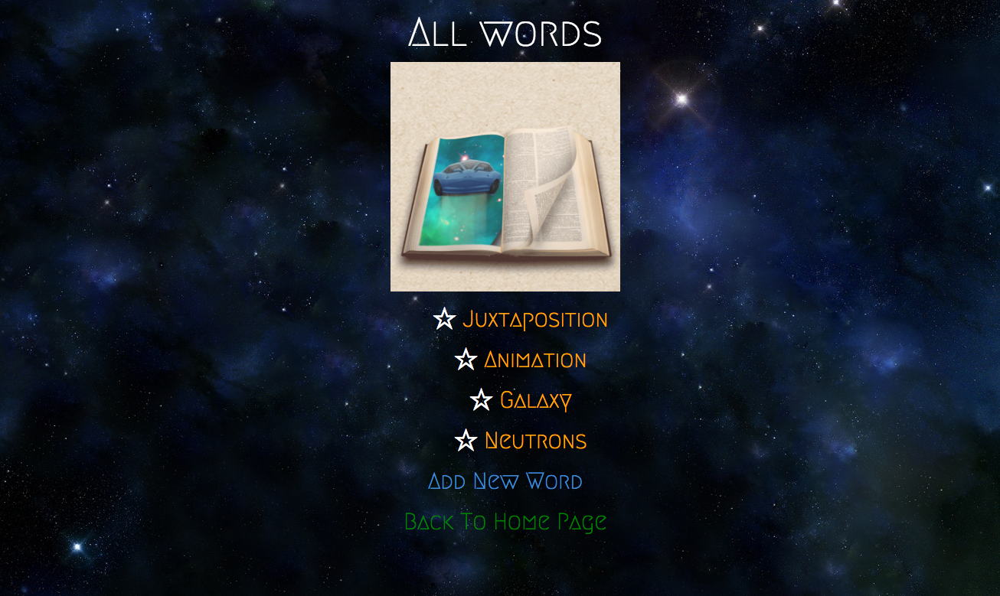

# _Galactic Dictionary_

#### _An interactive Java web app that allows a user to populate a virtual dictionary with the most awesome words they can think of!_

#### By _**Adam Craig**_

## Description

_An interactive Java web app that allows a user to enter as many words as they would like into a space-themed virtual dictionary. The user can add multiple definitions to each word and words/definitions are saved between pages._

## Setup/Installation Requirements

* _In the command line, clone the git repository to a directory (git clone https://github.com/AdamCraig/dictionary). Navigate to the local repository's folder and use gradle to run the server (gradle run). Then, in an internet browser, access "localhost:4567" (or your custom port)_

## Known Bugs

_No known bugs at this time._

## Support and contact details

_For all issues and support, please contact:
Adam Craig at ajcraig@suffolk.edu_

## Technologies Used

_Java, Spark, JUnit, Gradle, Velocity, FluentLenium, HTML, CSS, Bootstrap_

### License

_The MIT License (MIT)

Copyright (c) [2016] [Adam Craig]

Permission is hereby granted, free of charge, to any person obtaining a copy
of this software and associated documentation files (the "Software"), to deal
in the Software without restriction, including without limitation the rights
to use, copy, modify, merge, publish, distribute, sublicense, and/or sell
copies of the Software, and to permit persons to whom the Software is
furnished to do so, subject to the following conditions:

The above copyright notice and this permission notice shall be included in all
copies or substantial portions of the Software.

THE SOFTWARE IS PROVIDED "AS IS", WITHOUT WARRANTY OF ANY KIND, EXPRESS OR
IMPLIED, INCLUDING BUT NOT LIMITED TO THE WARRANTIES OF MERCHANTABILITY,
FITNESS FOR A PARTICULAR PURPOSE AND NONINFRINGEMENT. IN NO EVENT SHALL THE
AUTHORS OR COPYRIGHT HOLDERS BE LIABLE FOR ANY CLAIM, DAMAGES OR OTHER
LIABILITY, WHETHER IN AN ACTION OF CONTRACT, TORT OR OTHERWISE, ARISING FROM,
OUT OF OR IN CONNECTION WITH THE SOFTWARE OR THE USE OR OTHER DEALINGS IN THE
SOFTWARE._
